# Introduccion_SNAP

<h1>Introducción al uso de imágenes de Radar de Apertura Sintética aplicado a la agricultura</h1> 
<h2>Manual básico de introducción a SNAP</h2> 

Este manual fue elaborado por la Escuela de Geografía de la Universidad de Costa Rica, para el cual colaboraron Emmanuel Jesús Céspedes-Rivera y Cristian Aguilar-Barboza en calidad de asistentes avanzados del proyecto "Transformación digital: Incorporación de tecnología SAR en la gestión de riesgos, agricultura y recursos naturales para Centroamérica", en el marco del proyecto UCREA-IICA.

Este proyecto está coordinado por el Dr Edgar Espinoza Cisneros y co-cordinado por MSc María José Molina Montero. Para mayor información contactar a maria.molinamontero@ucr.ac.cr .

 

Índice
 

<li><a href="#Sección1">1. Prerrequisitos</a></li>
<li><a href="#Sección2">2. Objetivos de aprendizaje</a></li>
<li><a href="#Sección3">3. Interfaz de Usuario del software SNAP</a></li>
<li><a href="#Sección4">4. Interpretando una imagen radar</a></li>
<li><a href="#Sección5">5. Bibliografía</a></li>

 

<h2 id="Sección1">1. Prerrequisitos</h2>

 

Para ejecutar esta rutina el usuario debe instalar previamente el software Sentinel Toolbox (SNAP), el cual es un software de procesamiento para el análisis y observación de la tierra, con herramientas enfocadas en extensibilidad de datos, portabilidad, procesamiento en marcos gráficos, entre otras herramientas (ESA, 2020).

La descarga del software SNAP se puede realizar en la siguiente dirección electrónica
 

<a href="http://step.esa.int/main/download/snap-download/" target="_blank">http://step.esa.int/main/download/snap-download/</a>
 
 
 
<h2 id="Sección2">2. Objetivos de aprendizaje</h2> 

<li>Explorar la interfaz del software SNAP.</li>
<li>Visualizar imágenes del radar Sentinel 1</li>
<li>Describir las características básicas de una imagen radar.</li>

<h3>2.1 Datos a descargar</h3>

Los datos a utilizar en este ejercicio se pueden descargar en el siguiente link:
 
<a href="https://www.dropbox.com/sh/xb6nb8qwva3e0l8/AACgAV2tx4xtUFa1QtDZKZxUa?dl=0" target="_blank">https://www.dropbox.com/sh/xb6nb8qwva3e0l8/AACgAV2tx4xtUFa1QtDZKZxUa?dl=0</a>

Para este ejercicio se utilizará una imagen radar de apertura sintética tipo GRD de Sentinel-1, estas se pueden obtener de forma gratuita en los repositorios de información Alaska Satellite Facility Vertex y Copernicus Open Access Hub, en ambos casos se debe crear -en caso de no tenerse- una cuenta de acceso que permite descargar información satelital a nivel global.

<h4>Alaska Satellite Facility Vertex</h4> 

Buscador de datos:
<a href="https://search.asf.alaska.edu/#/" target="_blank">https://search.asf.alaska.edu/#/</a>

Registro de cuenta:
<a href="https://urs.earthdata.nasa.gov/users/new" target="_blank">https://urs.earthdata.nasa.gov/users/new</a>

<h4>Copernicus Open Access Hub</h4>  

Buscador de datos:
<a href="https://scihub.copernicus.eu/dhus/#/home" target="_blank">https://scihub.copernicus.eu/dhus/#/home</a>

Registro de cuenta:
 <a href="https://scihub.copernicus.eu/dhus/#/self-registration" target="_blank">https://scihub.copernicus.eu/dhus/#/self-registration</a>

<h2 id="Sección3">3. Interfaz de Usuario del software SNAP</h2>

El espacio de trabajo en SNAP está conformado con un menú de archivos (1), un menú de botones (2), el panel de capas (3), espacio de localización (4) y área de trabajo (5) (Fig 1).
 

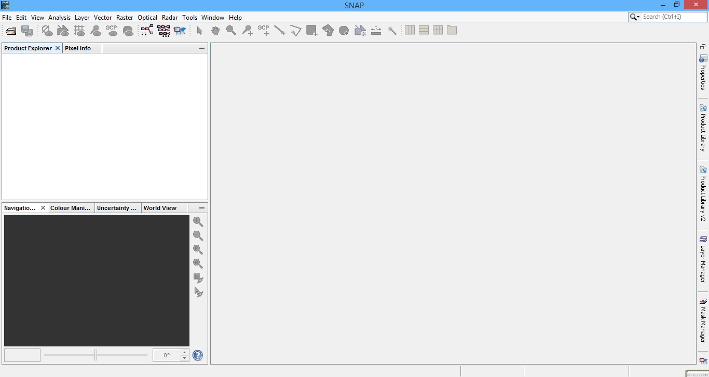

<h4 id="Sección3">Fig. 1. Interfaz de la vista general de SNAP.</h4>

Abrir archivos en SNAP

Los archivos se pueden abrir mediante: File/Open Product… o seleccionando 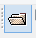 (Fig 2).
 

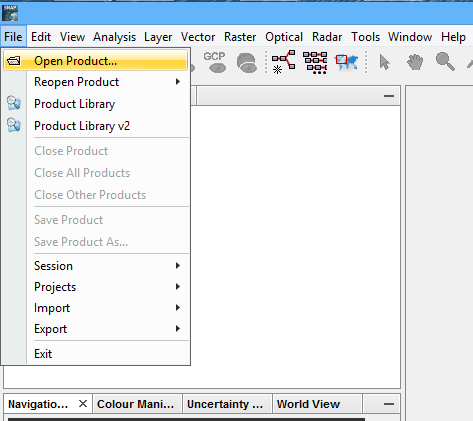

<h4 id="Sección3">Fig. 2. Abrir archivos en SNAP.</h4>

Se debe tener claro el tipo de archivo que se desea abrir, en la sección Files of type debe identificar el formato de información que desea manejar(flecha roja) (Fig 3). Finalmente debe seleccionar y abrir el archivo de interés.

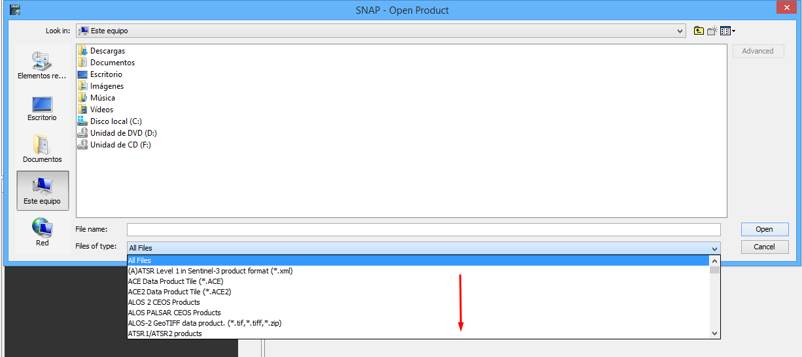
<h4 id="Sección3">Fig 3.Búsqueda del archivo de interés y la selección de formato.</h4>

Una vez abierto el archivo de interés en <strong>Product Explorer</strong> se visualiza el archivo de la imagen, este incluye los metadatos de la imagen (<strong>Metadata</strong>), así como las bandas (<strong>Bands</strong>) de la imagen, en este caso, las polarizaciones VV y VH. En la parte inferior de la imagen, en la opción <strong>Worldview</strong>, se muestra la localización del área de estudio (Fig 4).

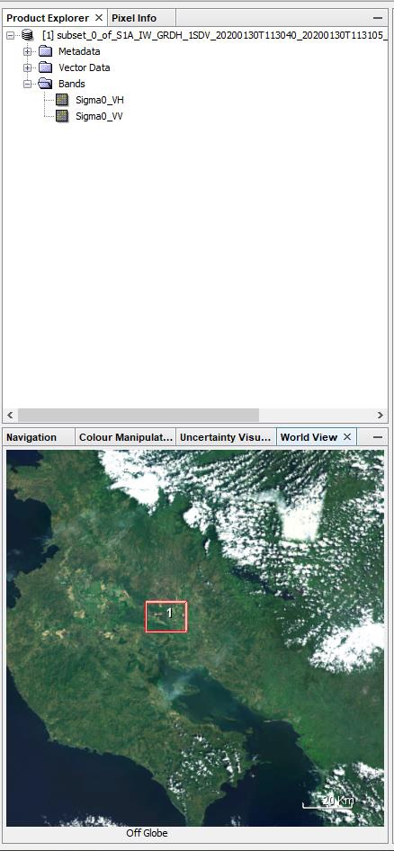
<h4 id="Sección3">Fig 4. Resultado de cargar una imagen a SNAP. En el recuadro rojo se marca el espacio que cubre la imagen descargada</h4>

Para visualizar la imagen radar, presione doble click sobre cada una de las bandas <strong>Sigma0_VH y Sigma0_VV</strong> (Fig 5).

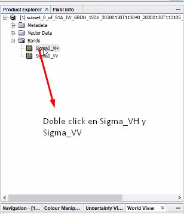
<h4 id="Sección3">Fig 5. Cargar imágenes <strong>Sigma0_VH y Sigma0_VV</strong>.</h4>

Las Imágenes desplegadas en la interfaz de SNAP se visualizan en la Fig 6.

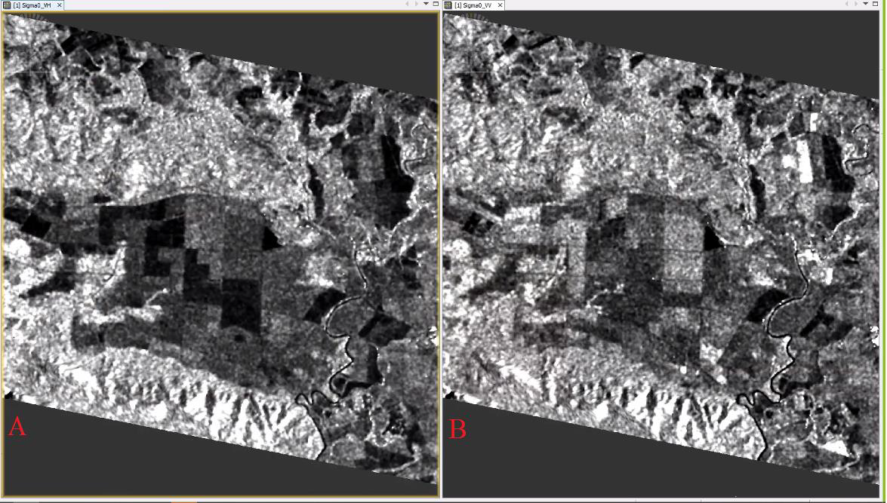
<h4 id="Sección3">Fig 6. Visualización de imágenes. La imagen de la izquierda (A) corresponde a <strong>Sigma0_VH</strong>, la imagen derecha (B) corresponde a <strong>Sigma0_VV</strong>.</h4>

En <strong>View/Tool Windows</strong> se puede añadir a la vista de la interfaz diferentes pestañas para analizar u observar los datos de la imagen (Fig 7).

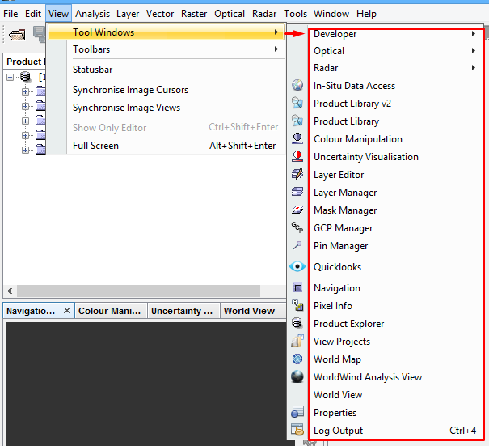
<h4 id="Sección3">Fig 7. Añadir ventanas a la interfaz de inicio de SNAP.</h4>

El software contiene una caja de herramienta/Toolbox para el preprocesamiento y procesamiento especializado de imágenes radar (Radar) (Fig 8).

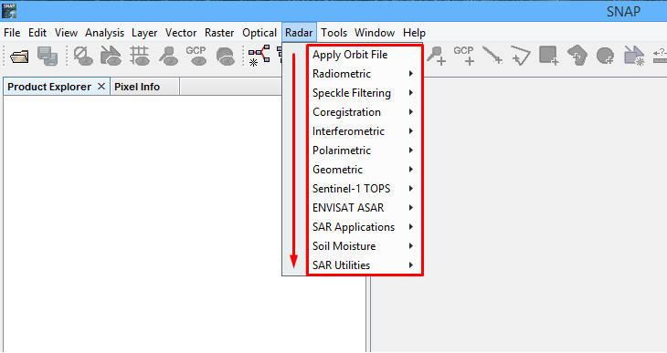
<h4 id="Sección3">Fig 8. Toolbox Radar en SNAP.</h4>

<h2 id="Sección4">4. Interpretando una imagen radar.</h2>

Los sensores radar envían pulsos laterales hasta la superficie del terreno, donde parte de la señal emitida regresa al sensor, este retorno de la señal se conoce como retrodispersión. La intensidad de la retrodispersión está directamente relacionada con el tipo de cobertura y sus características, permitiendo así la clasificación y evaluación del estado de las coberturas.

Se suelen distinguir tres grandes tipos de retrodispersión:

<li>1. Retrodispersión especular (superficies lisas/aguas abiertas)</li>

<li>2. Retrodispersión por volumen (dosel del bosque)</li>

<li>3. Retrodispersión por doble rebote (bosques/ infraestructura/ suelos muy rugosos y húmedos)</li>

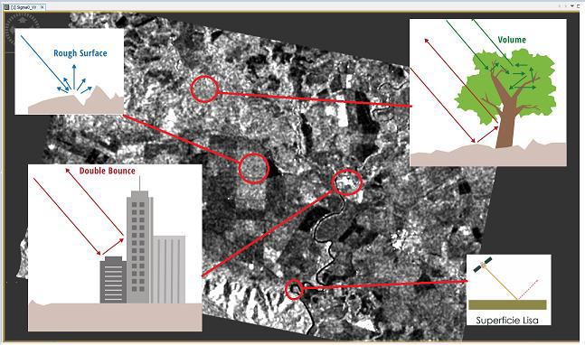
<h4 id="Sección3">Fig 9. Tipos de respuesta en la retrodispersión según características de la cobertura.</h4>

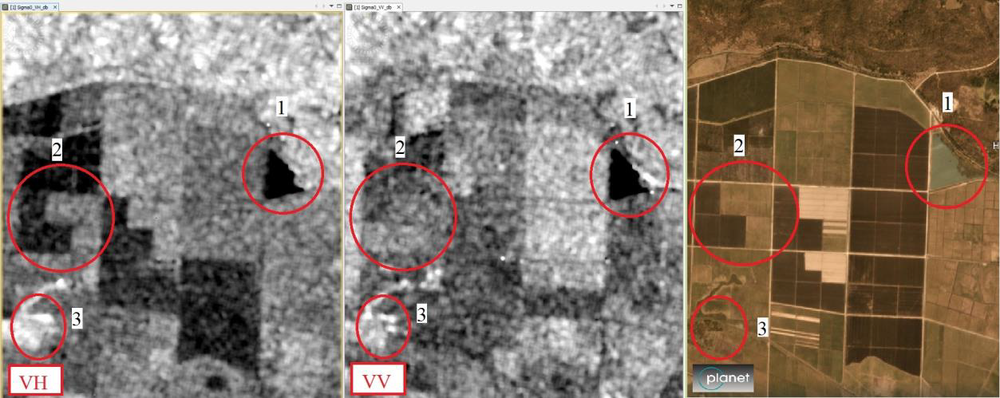
<h4 id="Sección3">Fig 10. Retrodispersión especular (1), de superficie áspera (2) y por volumen (3).</h4>

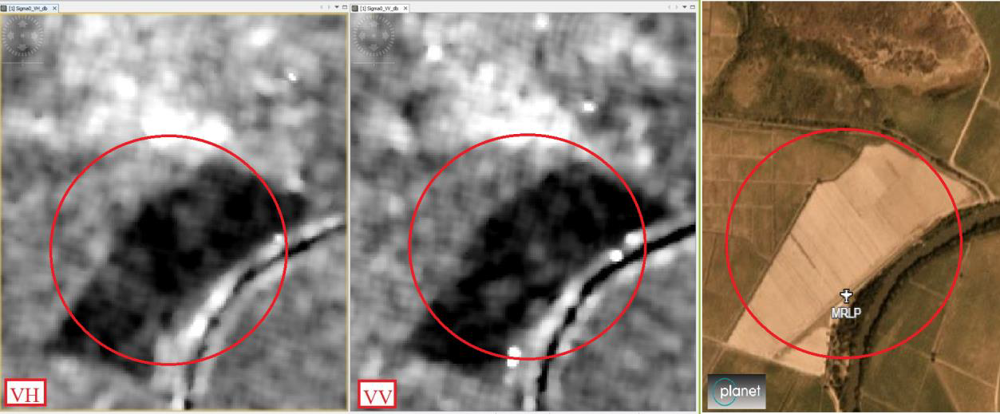
<h4 id="Sección3">Fig 11. Retrodispersión en superficie áspera en aparente condición de suelo seco.</h4>

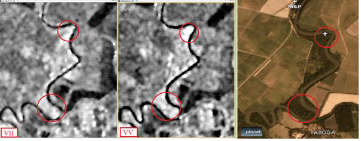
<h4 id="Sección3">Fig 12. Retrodispersión de doble rebote en bosque ribereño.</h4>

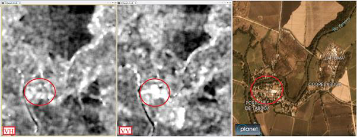
<h4 id="Sección3">Fig 13. Retrodispersión de doble rebote en área urbana.</h4>

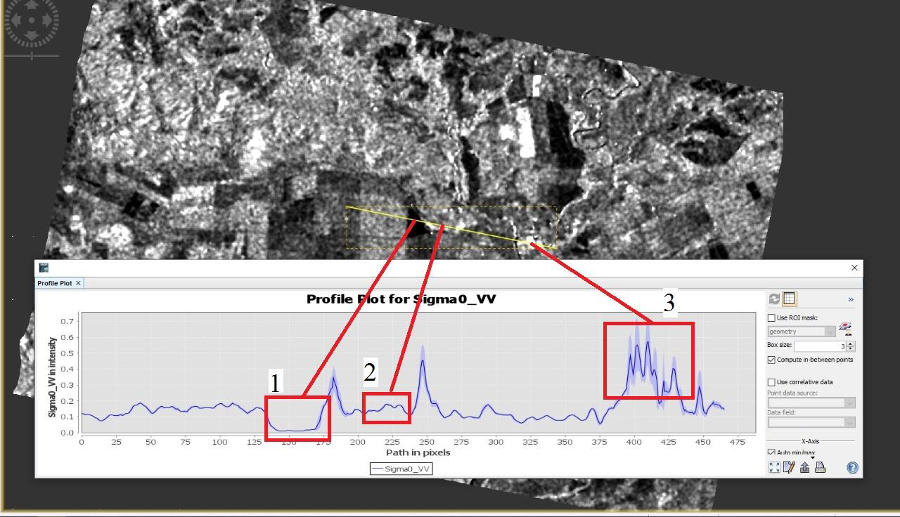
<h4 id="Sección3">Fig 14.Perfil de valores de retrodispersión, se evidencia de forma gráfica la variación en los valores para la polarización VV, retrodispersión especular (1), retrodispersión en superficie áspera (2) y de doble rebote en área urbana (3).</h4>

<h3>4.1 RGB de una imagen SAR</h3> 

Una forma de discriminar visualmente los distintos tipos de retrodispersión en una escena es mediante la creación de un RGB o combinación de bandas. Es preciso mencionar que los distintos valores de retrodispersión están condicionados por una serie de características como la constante dieléctrica, atmosférica y relacionada con la estructura de la cobertura.

 

Para visualizar la imagen SAR en RGB debe presionar click derecho sobre el nombre de la imagen y luego seleccione la opción <strong>Open RGB Image Window</strong>.

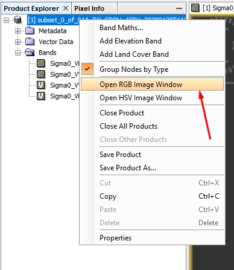
<h4 id="Sección3">Fig 15. Abrir opción para creación de RGB de la imagen de trabajo.</h4>

En el recuadro que se despliega seleccione en el canal rojo la banda en polarización VV, en canal verde banda en polarización VH y en el canal azul coloque las bandas VV y VH (Fig 16).Las unidades en cada banda se encuentran en decibeles (dB).

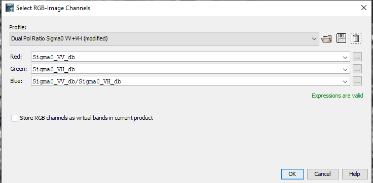
<h4 id="Sección3">Fig 16. Crear RGB.</h4>

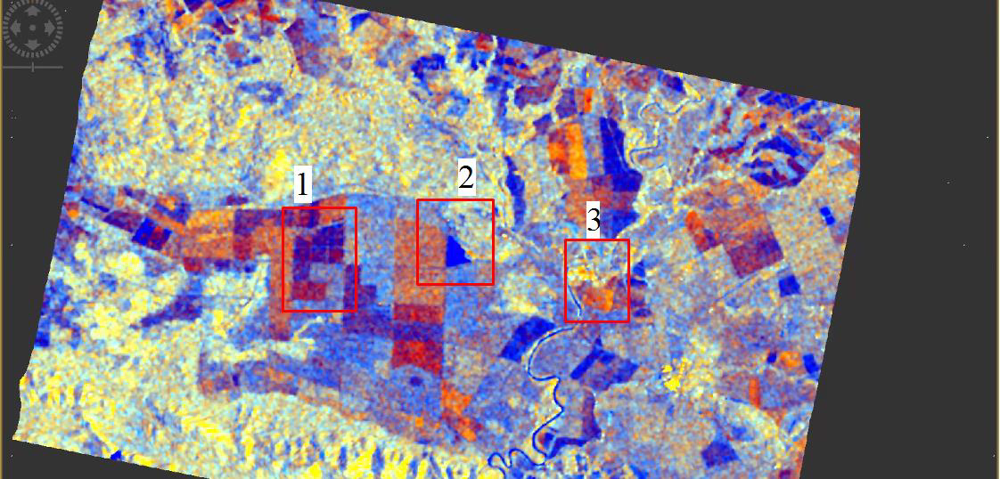
<h4 id="Sección3">Fig 17. RGB del área de estudio en dB, retrodispersión en superficie áspera <strong>(1)</strong> (ver Fig 9. círculo 2), retrodispersión de doble rebote en cuerpos de agua <strong>(2)</strong> (ver Fig 9, círculo 1) y retrodispersión de doble rebote en ciudad <strong>(3)</strong> (ver Fig 11).</h4>

<h2 id="Sección5">5. Bibliografía</h2>

European Space Agency (ESA). (2020). SNAP STEP. <a href="https://step.esa.int/main/toolboxes/snap/ " target="_blank">https://step.esa.int/main/toolboxes/snap/ </a>

Recursos adicionales recomendados:

<li><a href="https://www.youtube.com/watch?v=DibAtfHoc6U" target="_blank">https://www.youtube.com/watch?v=DibAtfHoc6U</a></li>
<li><a href="https://step.esa.int/main/doc/tutorials/" target="_blank">https://step.esa.int/main/doc/tutorials/</a></li>
<li><a href="https://forum.step.esa.int/" target="_blank">https://forum.step.esa.int/</a></li>
<li><a href="https://www.youtube.com/watch?v=QdKkTQ7fWH0" target="_blank">https://www.youtube.com/watch?v=QdKkTQ7fWH0</a></li>

Para más detalles puede ver el siguiente video tutorial, donde se ilustran los pasos para ejecutar lo mostrado en este manual:

<iframe width="420" height="315" src="https://www.youtube.com//embed//DVyObmwC45o/"></iframe> 
 
